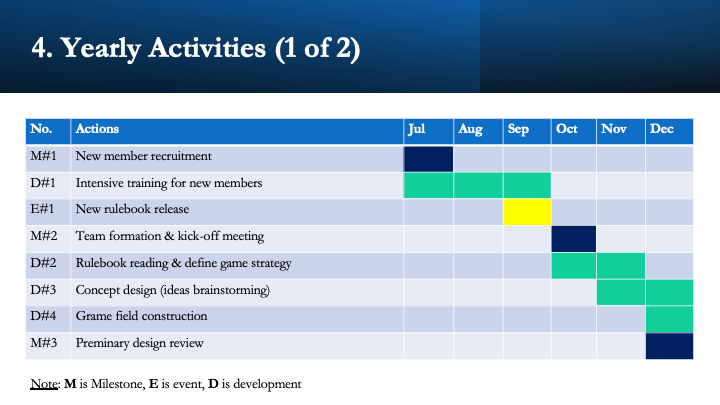
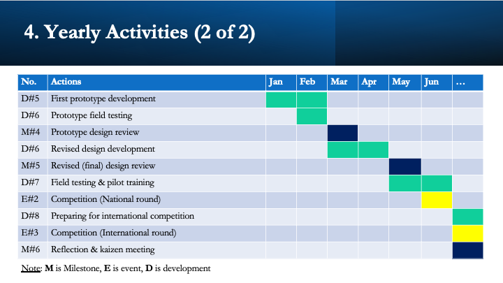

# Leading a Robotics Team in University - System Engineering Approach
A system engineering aproach of how to lead a robotics team in university. 
It is based on author personal's experience of leading an university robotics team in Cambodia.

## Contents
1. Goal & Strategy
2. Finance
3. Yearly Activities
4. Team Organization
5. Trainings [(Additional Links)](https://github.com/MorokotSakal/robotics-se/tree/main/Trainings)
6. Meetings

## Slides
<<<<<<< HEAD

=======

>>>>>>> 1979933b8508740034f6f15216f79a194759d7e7
